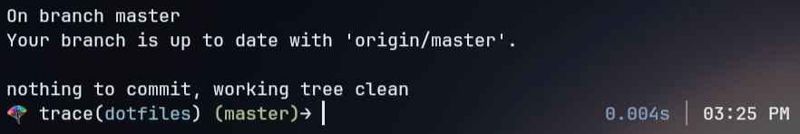

# dotfiles


Welcome to my humble abode.

## Setup

1. Clone this repository to your home directory:
   ```bash
   git clone <repo-url> ~/dotfiles
   ```

2. Set up your `.bashrc` to use the dotfiles:
   ```bash
   cp ~/dotfiles/.bashrc_template ~/.bashrc
   ```

   Or manually add this line to your existing `~/.bashrc`:
   ```bash
   source ~/dotfiles/load_config.sh
   ```

3. Reload your shell configuration:
   ```bash
   source ~/.bashrc
   ```

## How It Works

The `load_config.sh` script automatically:
- Detects your operating system (Linux, macOS, etc.)
- Loads all configs from `.shell_config/agnostic/` (OS-independent)
- Loads OS-specific configs from `.shell_config/{os}/` (e.g., `.shell_config/linux/` or `.shell_config/mac/`)

## Adding New Configs

- **OS-agnostic configs**: Add files to `.shell_config/agnostic/`
- **OS-specific configs**: Add files to `.shell_config/linux/` or `.shell_config/mac/`

All files in these directories will be automatically sourced when your shell starts.

## Structure

```
dotfiles/
├── .shell_config/
│   ├── agnostic/          # Configs that work on all OSes
│   │   ├── git
│   │   ├── languages
│   │   ├── misc
│   │   └── navigation
│   ├── linux/             # Linux-specific configs
│   │   └── misc
│   └── mac/               # macOS-specific configs
│       └── misc
├── load_config.sh         # Main script that loads configs based on OS
├── .bashrc_template       # Template for ~/.bashrc
└── README.md
```